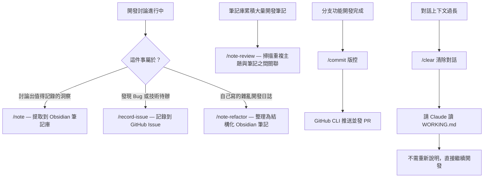

## 起點

一開始想練習怎麼跟 AI 協作開發，所以課 claude 後去作了一個 side project。
協作方式很單純 — 就是把我要做的東西直接問AI，然後AI會給我分析、建議，接著我在自己去作判斷與決定。把寫程式的部分完全交給 AI 。

開發節奏大概是這樣：跟 AI 討論需求 → 判斷決策 → AI 實作 → 看code跟畫面有沒有壞掉 → commit。照著這個循環不斷重複，直到完成開發。

做久了發現，這個過程常常在**重複做同樣的事** — 重新解釋背景、手動複製貼上、來回切換工具。每次覺得煩就會問自己：「這件事為什麼要我手動做？」然後想辦法把它自動化。

這篇就是記錄這個過程。

---

## 最早的煩：手動貼筆記到 Notion

跟 AI 討論的時候常常會聊出值得記錄的東西 — 一個觀念被釐清、一個之前沒想到的做法。但我的處理方式就是複製 AI 的回覆，貼到 Notion。

先不說**貼過去格式會跑掉，還全部都是沒整理過的原始對話，就都堆在那邊。** 日子一久根本不會回去看，記了也等於沒記。

有一天發現 Claude Code 可以寫指令（command），用 `/` 觸發讓 AI 做事。我就想 — 那我叫 AI 整理好再輸出不就好了？

所以我寫了 `/note`，讓 AI 根據對話上下文產出結構化筆記，直接輸出到 Obsidian 筆記庫。不用手動複製、不用自己排版，AI 產出後直接去看就好。

這是我第一個自動化的東西，解決之後覺得：原來可以這樣啊。

---

## 用文件跟 AI 溝通

開發到一段時間後，我習慣每討論完一個小主題就 `/clear` 清掉對話重來。因為對話聊太長，討論的又不相關的話，AI 就會開始出現混亂的回答，而我自己也很難追蹤之前討論的內容。

但清掉對話之後，AI 不知道我開發到哪了。遇到有關聯的主題，我還要把之前討論過的背景重新解釋一次。我就想：**那是不是可以寫成文件讓 AI 自己去看，我就不用反覆的講？**

想到這件事的時候，side project 已經快開發完了，正要進入重構階段。原本重構都要在對話中一次次討論，對話超長，而且不知道哪裡完成了、哪邊還要繼續。

所以我請 AI 掃了整個專案，產出一份完整的 code review。在看對話的當下就想著，為什麼不能把這些整理成文件給 AI 讀呢？那下次對話讓 AI 去讀就好啦。於是就讓 AI 把結果整理成文件，之後每次開新對話就讓 AI 讀這份文件接著往下做。

這是開發完的事後整理。做完之後就在想：既然事後的文件能讓 AI 接著做，那開發之前是不是也能先寫好，讓 AI 從一開始就有上下文？

到了第二個專案（就是這個部落格），我直接嘗試先跟 AI 討論需求和架構，整理成一份 `WORKING.md` — 不是什麼正式的規格文件，就是把背景、技術選型、進度、之前的決策寫在同一個地方。每次開新對話讓 AI 先讀這份文件，就能直接接續上次的進度。

---

## 把問題追蹤從筆記裡拆出來

開發過程中常常發現 bug 或技術待辦，但不是當下要處理的，就會先記下來。

一開始我一樣都貼到 Notion，**筆記跟問題全部混在同一頁上。** 哪些是學到的東西、哪些是要修的 bug，日子一久根本分不清楚，整理起來超痛苦。

跟 AI 討論後，決定用 GitHub Issue 來管。一開始也是手動 — 自己到網頁上開 issue、到要處理時再從 GitHub 貼回對話。這樣貼來貼去真的很麻煩，後來發現原來 GitHub 早就有 CLI，於是我就寫了 `/record-issue`，讓 AI 根據對話直接幫我到 github 開 Issue。

裝了 GitHub CLI 之後，能做的事變多了。我又寫了 `/maintenance-plan`，讓 AI 掃整個專案做 code review，同時把所有 GitHub Issue 讀進來，產出一份維護計畫。修完問題後 AI 還能直接發 PR，對應的 Issue 自動關閉。

等於從「記錄問題 → 追蹤問題 → 修完關閉」整個流程都串起來了。

---

## 筆記累積之後的新問題

筆記自動化之後，Obsidian 裡的筆記越來越多。但每一篇都是當時獨立對話產生的，彼此之間沒有關聯。AI 不會事先知道我已經有哪些筆記，所以重複的概念散落在不同篇，相關的主題也沒有串在一起。

我又要花時間自己整理這些筆記，就想著 — 能不能讓 AI 來做就好？

所以我寫了 `/note-review`，讓 AI 掃描整個筆記庫，分析哪些筆記是重複的、哪些是有關聯的，再對這些筆記做處理。另外也寫了 `/note-refactor`，把我自己手寫的雜亂筆記整理成同樣的結構化格式。

---

## 全貌

### Commands 一覽

文件位置：`~/.claude/commands/`，跨專案共用。

**專案開發：**

| Command             | 用途                                                      |
| ------------------- | --------------------------------------------------------- |
| `/commit`           | 分析變更，產生 Conventional Commits 格式的 commit message |
| `/code-review`      | 對程式碼做 code review，分三個優先層級回饋                |
| `/maintenance-plan` | 整個專案 code review + 整合 GitHub Issues，產出維護計畫   |
| `/record-issue`     | 把對話中發現的問題記錄到 GitHub Issue                     |

**學習筆記：**

| Command          | 用途                                       |
| ---------------- | ------------------------------------------ |
| `/note`          | 從對話中提取洞察，產出結構化 Obsidian 筆記 |
| `/note-refactor` | 讀取原始筆記，整理成結構化格式             |
| `/note-review`   | 掃描筆記庫，找出重複主題與孤立筆記         |

---

## 這樣做之後

最明顯的差別是不用再重複解釋了。以前開一個新對話要花好幾分鐘貼背景、說進度，現在一句「讀 WORKING.md」就能接著做。

筆記也不再是堆在 Notion 裡不會回去看的東西，而是有結構、可以搜尋的知識庫。問題跟筆記不會再混在一起 — 該追蹤的在 GitHub Issue，該沉澱的在 Obsidian。

但更大的改變是心態上的。以前遇到重複的事情就忍著做，現在會直覺地想「這能不能自動化」。不一定每次都值得做，但這個習慣讓工作流一點一點長出來。

---

## 還在摸索中

這套工作流還有很多不完整的地方 — 沒有測試、文件寫法還在摸索、所有 command 都是手動觸發。

但目前夠用，而且比以前好很多。
