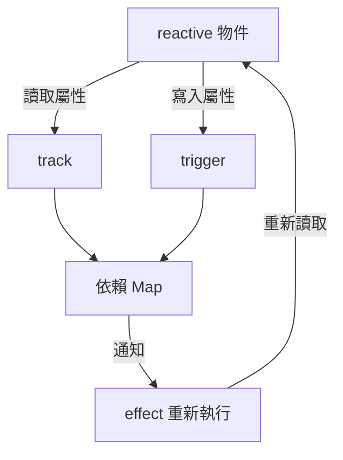

Vue 3 的響應式系統是整個框架的核心，理解它能幫助你寫出更高效的程式碼，並在遇到奇怪的 bug 時快速定位原因。

## 核心概念

Vue 3 響應式系統由三個主要部分組成：

- **`reactive()`** — 將物件轉為響應式 Proxy
- **`effect()`** — 追蹤依賴並在資料變更時重新執行
- **`track / trigger`** — 依賴收集與觸發的內部機制

## 資料流架構



## 最簡單的實作

下面是一個極簡版響應式系統，幫助理解原理：

```typescript
type EffectFn = () => void;

let activeEffect: EffectFn | null = null;
const targetMap = new WeakMap<object, Map<string, Set<EffectFn>>>();

function track(target: object, key: string) {
  if (!activeEffect) return;

  let depsMap = targetMap.get(target);
  if (!depsMap) targetMap.set(target, (depsMap = new Map()));

  let deps = depsMap.get(key);
  if (!deps) depsMap.set(key, (deps = new Set()));

  deps.add(activeEffect);
}

function trigger(target: object, key: string) {
  const deps = targetMap.get(target)?.get(key);
  deps?.forEach((fn) => fn());
}

function reactive<T extends object>(raw: T): T {
  return new Proxy(raw, {
    get(target, key: string) {
      track(target, key);
      return Reflect.get(target, key);
    },
    set(target, key: string, value) {
      Reflect.set(target, key, value);
      trigger(target, key);
      return true;
    },
  });
}

function effect(fn: EffectFn) {
  activeEffect = fn;
  fn();
  activeEffect = null;
}
```

## 使用範例

```typescript
const state = reactive({ count: 0 });

effect(() => {
  console.log("count is:", state.count);
});
// 輸出：count is: 0

state.count++;
// 輸出：count is: 1
```

## 與 Vue 2 的差異

| 特性         | Vue 2（Object.defineProperty） | Vue 3（Proxy）          |
| ------------ | ------------------------------ | ----------------------- |
| 新增屬性     | 需要 `Vue.set()`               | 自動追蹤                |
| 陣列索引賦值 | 無法偵測                       | 自動追蹤                |
| 效能         | 初始化時遍歷所有屬性           | 惰性（Lazy）代理        |
| 支援型別     | 僅 Object                      | Object、Array、Map、Set |

## 常見陷阱

解構響應式物件會失去響應性：

```typescript
const state = reactive({ count: 0 });

// ❌ 失去響應性
const { count } = state;

// ✅ 保持響應性
const { count } = toRefs(state);
```

---

理解響應式系統的底層機制後，你會發現 Vue 的設計相當優雅——用最少的 API 實現了強大的追蹤能力。


